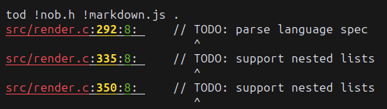

# tod

A simple command line tool written in C for finding all **TODOS** in your project.

## How to use
To build `tod`, simply run `build.sh`  
When you run `tod` on a directory, it will find all `'TODO:'` strings within.
To ignore a specific file, provide `-i<name>`.

